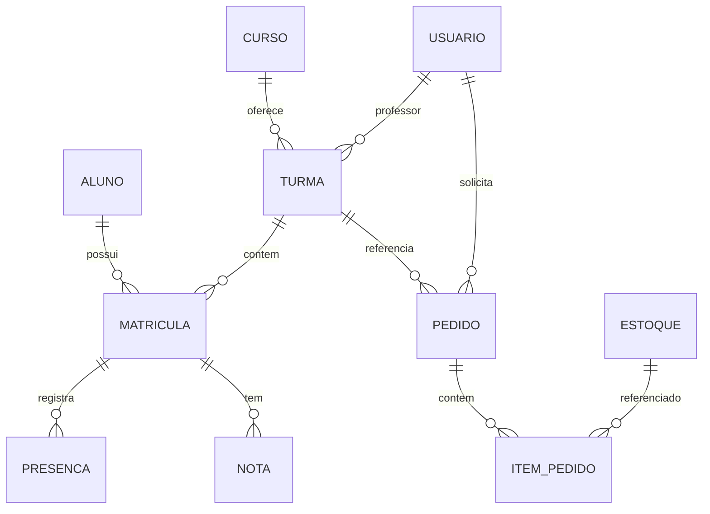

<div align="center">
  <h1 align="center">SGA ABACO</h1>
  <p align="center"><strong>Sistema de Gestão Acadêmica — Associação ABACO</strong></p>
  <p align="center">
    Plataforma web para digitalização dos processos acadêmicos e administrativos de uma ONG de cursos profissionalizantes.
  </p>
</div>

<p align="center">
  
  
  
  
  
  
  
  
  
</p>

---

## Visão Geral

O **SGA ABACO** é um sistema de gestão acadêmica desenvolvido para a **Associação ABACO**, uma ONG que oferece cursos profissionalizantes gratuitos para a comunidade. Antes deste sistema, todos os processos administrativos eram realizados manualmente, gerando atrasos e dificuldades na gestão das turmas.

O sistema digitaliza e integra os fluxos de:

- **Módulo Acadêmico** — cadastro de alunos, cursos, turmas, matrículas, presença e notas
- **Módulo Logístico** — requisição de materiais, aprovação de pedidos e controle de estoque
- **Módulo Administrativo** — gestão de usuários, permissões e dashboards

---

## Tecnologias

### Backend

| Tecnologia | Versão | Finalidade |
|---|---|---|
| [Python](https://www.python.org/) | 3.11 | Linguagem de programação |
| [FastAPI](https://fastapi.tiangolo.com/) | 0.136.1 | Framework web assíncrono |
| [SQLAlchemy](https://www.sqlalchemy.org/) | 2.0.43 | ORM para acesso ao banco de dados |
| [Pydantic](https://docs.pydantic.dev/) | 2.13.4 | Validação de dados e schemas |
| [PyJWT](https://pyjwt.readthedocs.io/) | 2.10.1 | Autenticação via tokens JWT |
| [Passlib](https://passlib.readthedocs.io/) (bcrypt) | 1.7.4 | Hash de senhas |
| [Uvicorn](https://www.uvicorn.org/) | 0.47.0 | Servidor ASGI |
| [psycopg2-binary](https://www.psycopg.org/) | 2.9.11 | Driver PostgreSQL |

### Frontend

| Tecnologia | Versão | Finalidade |
|---|---|---|
| [Angular](https://angular.dev/) | 21.2 | Framework de componentes SPA |
| [TypeScript](https://www.typescriptlang.org/) | 5.9 | Superset tipado do JavaScript |
| [RxJS](https://rxjs.dev/) | 7.8 | Programação reativa |
| [Vitest](https://vitest.dev/) | 4.0 | Testes unitários |

### Infraestrutura

| Tecnologia | Versão | Finalidade |
|---|---|---|
| [Docker](https://www.docker.com/) | — | Containerização dos serviços |
| [Docker Compose](https://docs.docker.com/compose/) | — | Orquestração dos containers |
| [PostgreSQL](https://www.postgresql.org/) | 16 | Banco de dados relacional |

---

## Justificativa das Escolhas Técnicas

### FastAPI (Python)

- **Performance** — Framework assíncrono com performance comparável a Node.js e Go, ideal para APIs REST.
- **Validação nativa** — Integração direta com Pydantic para validação de schemas de entrada e saída sem bibliotecas adicionais.
- **Documentação automática** — Gera automaticamente Swagger UI e ReDoc a partir das type hints.
- **Ecossistema Python** — Ideal para equipes com背景 em Python, comum em projetos acadêmicos e ONGs.

### Angular 21 + TypeScript

- **Componentes standalone** — Arquitetura moderna sem módulos NgModule, simplificando a estrutura do projeto.
- **Sinais (Signals)** — Sistema reativo granular para detecção de mudanças, mais previsível que Zone.js puro.
- **Tipagem forte** — TypeScript reduz erros em tempo de execução e melhora a manutenibilidade.
- **CLI maduro** — Ferramentas integradas para build, testes e deploy.

### SQLAlchemy 2.0

- **ORM maduro** — Mapeamento objeto-relacional completo com suporte a múltiplos bancos.
- **Type annotations** — Suporte nativo a `Mapped` e `mapped_column` para models tipados.
- **Flexibilidade** — Permite queries raw quando necessário sem sair do ecossistema.

### Docker Compose

- **Ambiente reproduzível** — Garante que todos os desenvolvedores executem o mesmo ambiente.
- **Isolamento** — Cada serviço (banco, backend, frontend) roda em seu próprio container.
- **Health checks** — Garante a ordem de inicialização correta entre os serviços.

---

## Arquitetura

```
┌─────────────────────────────────────────────────────────────┐
│                    Frontend (Angular 21)                     │
│  Porta 3000 (produção) / 4200 (desenvolvimento)             │
│  ┌──────────┐ ┌──────────┐ ┌──────────┐ ┌──────────────┐  │
│  │ Páginas  │ │Componentes│ │ Serviços │ │   Guards     │  │
│  │ (smart)  │ │(present.)│ │ (HTTP)   │ │  (auth/role) │  │
│  └──────────┘ └──────────┘ └──────────┘ └──────────────┘  │
└──────────────────────────┬──────────────────────────────────┘
                           │ HTTP / JSON
                           ▼
┌─────────────────────────────────────────────────────────────┐
│                    Backend (FastAPI)                          │
│  Porta 8000                                                  │
│  ┌──────────┐ ┌──────────┐ ┌──────────┐ ┌──────────────┐  │
│  │ Routers  │ │ Services │ │  Models  │ │   Schemas    │  │
│  │ (api/v1) │ │ (regras) │ │ (SQLAlch)│ │  (Pydantic)  │  │
│  └──────────┘ └──────────┘ └──────────┘ └──────────────┘  │
│                        │                                    │
│              ┌─────────┴─────────┐                          │
│              │  Core (JWT, Auth)  │                          │
│              └───────────────────┘                          │
└──────────────────────────┬──────────────────────────────────┘
                           │ SQL
                           ▼
              ┌─────────────────────────┐
              │    PostgreSQL 16        │
              │   sga_abacos database   │
              │   Porta 5432            │
              └─────────────────────────┘
```

### Estrutura do Projeto

```
ABACO_Sistema/
├── backend/                        # API FastAPI
│   ├── app/
│   │   ├── api/v1/                 # Rotas REST
│   │   ├── core/                   # Config, segurança, dependências
│   │   ├── db/                     # Conexão com banco
│   │   ├── models/                 # Modelos SQLAlchemy
│   │   ├── schemas/                # Schemas Pydantic
│   │   └── services/               # Regras de negócio
│   ├── Dockerfile
│   └── requirements.txt
├── frontend/                       # SPA Angular
│   ├── src/
│   │   ├── app/
│   │   │   ├── core/               # Models, services, guards
│   │   │   ├── features/           # Páginas por módulo
│   │   │   └── shared/             # Componentes reutilizáveis
│   │   └── environments/
│   ├── Dockerfile
│   └── angular.json
├── database-schema.sql             # Schema SQL inicial
├── docker-compose.yml              # Orquestração dos serviços
└── docs/                           # Documentação adicional
```

---

## Módulos do Sistema

### Acadêmico
| Funcionalidade | Status |
|---|---|
| Gerenciamento de Alunos | ✅ Implementado |
| Gerenciamento de Cursos | ✅ Implementado |
| Gerenciamento de Turmas | ✅ Implementado |
| Matrículas | ✅ Implementado |
| Registro de Presença | ✅ Implementado |
| Lançamento de Notas | ⬜ Pendente |
| Histórico Escolar | ⬜ Pendente |

### Logístico
| Funcionalidade | Status |
|---|---|
| Requisição de Materiais | ✅ Implementado |
| Aprovação de Pedidos | ✅ Implementado |
| Controle de Estoque | ✅ Implementado |

### Administrativo
| Funcionalidade | Status |
|---|---|
| Gestão de Usuários | ✅ Implementado |
| Dashboards | ⬜ Pendente |

---

## API REST

Base URL: `/api/v1`

| Método | Rota | Descrição |
|---|---|---|
| `POST` | `/auth/login` | Autenticação de usuário |
| `GET` | `/alunos` | Listar alunos |
| `POST` | `/alunos` | Criar aluno |
| `GET` | `/cursos` | Listar cursos |
| `POST` | `/cursos` | Criar curso |
| `GET` | `/turmas` | Listar turmas |
| `POST` | `/turmas` | Criar turma |
| `GET` | `/matriculas` | Listar matrículas |
| `POST` | `/matriculas` | Criar matrícula |
| `GET` | `/presencas/turma/{id}` | Presenças por turma |
| `POST` | `/presencas` | Registrar presenças |
| `GET` | `/pedidos` | Listar pedidos |
| `POST` | `/pedidos` | Criar pedido |
| `PUT` | `/pedidos/{id}/aprovar` | Aprovar pedido |
| `GET` | `/estoque` | Listar estoque |
| `POST` | `/estoque` | Adicionar item |
| `GET` | `/health` | Health check |

A documentação interativa da API está disponível em `/docs` (Swagger UI) quando o backend estiver rodando.

---

## Como Executar

### Pré-requisitos

- [Docker](https://docs.docker.com/get-docker/) e [Docker Compose](https://docs.docker.com/compose/install/)
- Git

### Desenvolvimento

```bash
# Clone o repositório
git clone https://github.com/IncludeLuisFerreira/ABACO_Sistema.git
cd ABACO_Sistema

# Inicie todos os serviços
docker compose up --build

# Acesse:
# - Frontend: http://localhost:3000
# - Backend API: http://localhost:8000
# - Swagger UI: http://localhost:8000/docs
```

### Desenvolvimento sem Docker

```bash
# Backend
cd backend
python -m venv venv
source venv/bin/activate
pip install -r requirements.txt
uvicorn main:app --reload --port 8000

# Frontend
cd frontend
npm install
ng serve

# Banco de dados (necessário PostgreSQL rodando)
# Execute database-schema.sql no banco sga_abacos
```

### Comandos úteis

```bash
# Parar serviços
docker compose down

# Resetar banco de dados (destrutivo)
docker compose down -v
docker compose up --build

# Executar testes do frontend
cd frontend && npm test
```

---

## Modelo de Dados



O schema completo está em [`database-schema.sql`](./database-schema.sql).

---

## Diagrama de Classes (Backend)


---

## Licença

Distribuído sob a licença MIT. Veja o arquivo [LICENSE](./LICENSE) para mais informações.

---

<div align="center">
  <p>
    <strong>SGA ABACO</strong> — Sistema de Gestão Acadêmica<br />
    Desenvolvido para a Associação ABACO
  </p>
</div>
