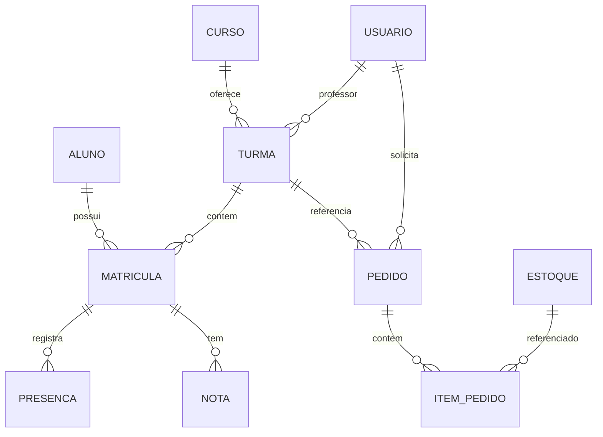

<div align="center">
  <h1 align="center">SGA ABACO</h1>
  <p align="center"><strong>Sistema de Gestão Acadêmica — Associação ABACO</strong></p>
  <p align="center">
    Plataforma web full-stack para gestão integrada de turmas, alunos, matrículas, presenças, notas e logística de materiais.
  </p>
</div>

<p align="center">
  
  
  
  
  
  
  
  
  
</p>

---

## Visão Geral

O **SGA ABACO** é um sistema de gestão acadêmica desenvolvido para a **Associação ABACO**, uma ONG que oferece cursos profissionalizantes gratuitos para a comunidade. Antes deste sistema, todos os processos administrativos eram realizados manualmente, o que gerava retrabalho, inconsistência nos registros e falta de visibilidade sobre o estoque e status de pedidos.

O sistema digitaliza e integra os fluxos de:

- **Módulo Acadêmico** — cadastro de alunos, cursos, turmas, matrículas, presença e notas
- **Módulo Logístico** — requisição de materiais, aprovação de pedidos e controle de estoque
- **Módulo Administrativo** — gestão de usuários, permissões e dashboards

A plataforma oferece três perfis de acesso — **Diretor(a)**, **Administrador(a)** e **Professor(a)** — cada um com funcionalidades específicas alinhadas às suas responsabilidades. Toda a comunicação entre frontend e backend é feita via **API REST** com autenticação **JWT**, e a infraestrutura é totalmente containerizada com **Docker Compose**.

**Status atual**: 100% funcional — 5 sprints concluídas, 107 testes automatizados passando, 3 perfis de usuário implementados, 11 módulos de API, deploy local via Docker.

---

## Funcionalidades por Perfil

### Diretor(a) — Cargo 1

| Módulo | Funcionalidades |
|--------|----------------|
| Dashboard | KPIs (alunos ativos, turmas em andamento, pedidos pendentes, itens críticos), gráficos de alunos por curso e consumo de materiais |
| Usuários | CRUD completo de usuários do sistema |
| Acadêmico | Gestão de alunos, cursos, turmas, matrículas, presenças e notas |
| Logístico | Visão geral, gestão de estoque (entrada/saída/alertas), aprovação de pedidos (solicitado → aprovado → comprado → entregue) |
| Histórico | Consulta de histórico escolar por matrícula com percentual de frequência |

### Administrador(a) — Cargo 3

| Módulo | Funcionalidades |
|--------|----------------|
| Acadêmico | Gestão completa de alunos, cursos, turmas, matrículas, presenças e notas |
| Logístico | Gestão de estoque e pedidos (exceto aprovação — exclusiva do diretor) |
| Histórico | Consulta de histórico escolar |

### Professor(a) — Cargo 2

| Módulo | Funcionalidades |
|--------|----------------|
| Home | Dashboard pessoal com KPIs das turmas sob sua responsabilidade |
| Minhas Turmas | Listagem de turmas com cards interativos e página de detalhes com gráfico de distribuição de notas |
| Alunos | Visualização de alunos matriculados em suas turmas, com filtro por turma |
| Presenças | Registro de presenças por turma e data de aula |
| Notas | Lançamento de notas por turma e prova |
| Logístico | Criação de pedidos de material para suas turmas, acompanhamento de status |

---

## Tecnologias

### Backend

| Tecnologia | Versão | Finalidade |
|---|---|---|
| [Python](https://www.python.org/) | 3.11 | Linguagem de programação |
| [FastAPI](https://fastapi.tiangolo.com/) | 0.136.1 | Framework web assíncrono |
| [SQLAlchemy](https://www.sqlalchemy.org/) | 2.0.43 | ORM para acesso ao banco de dados |
| [Pydantic](https://docs.pydantic.dev/) | 2.13.4 | Validação de dados e schemas |
| [PyJWT](https://pyjwt.readthedocs.io/) | 2.10.1 | Autenticação via tokens JWT |
| [Passlib](https://passlib.readthedocs.io/) (bcrypt) | 1.7.4 | Hash de senhas |
| [Alembic](https://alembic.sqlalchemy.org/) | 1.14 | Migrações de banco de dados |
| [SlowAPI](https://slowapi.readthedocs.io/) | 0.1 | Rate limiting em endpoints sensíveis |
| [Uvicorn](https://www.uvicorn.org/) | 0.47.0 | Servidor ASGI |
| [psycopg2-binary](https://www.psycopg.org/) | 2.9.11 | Driver PostgreSQL |

### Frontend

| Tecnologia | Versão | Finalidade |
|---|---|---|
| [Angular](https://angular.dev/) (standalone components) | 21.2 | Framework de componentes SPA |
| [TypeScript](https://www.typescriptlang.org/) | 5.9 | Superset tipado do JavaScript |
| [RxJS](https://rxjs.dev/) | 7.8 | Programação reativa |
| [ApexCharts](https://apexcharts.com/) + ng-apexcharts | 5.14 / 2.4 | Gráficos interativos |
| [Vitest](https://vitest.dev/) + jsdom | 4.0 / 28.0 | Testes unitários |

### Infraestrutura

| Tecnologia | Versão | Finalidade |
|---|---|---|
| [Docker](https://www.docker.com/) | — | Containerização dos serviços |
| [Docker Compose](https://docs.docker.com/compose/) | — | Orquestração dos containers |
| [PostgreSQL](https://www.postgresql.org/) | 16 | Banco de dados relacional |
| [Nginx](https://nginx.org/) | stable-alpine | Servidor web e proxy reverso |

---

## Justificativa das Escolhas Técnicas

### FastAPI (Python)

- **Performance** — Framework assíncrono com performance comparável a Node.js e Go, ideal para APIs REST.
- **Validação nativa** — Integração direta com Pydantic para validação de schemas de entrada e saída sem bibliotecas adicionais.
- **Documentação automática** — Gera automaticamente Swagger UI e ReDoc a partir das type hints.
- **Ecossistema Python** — Ideal para equipes com背景 em Python, comum em projetos acadêmicos e ONGs.

### Angular 21 + TypeScript

- **Componentes standalone** — Arquitetura moderna sem módulos NgModule, simplificando a estrutura do projeto.
- **Sinais (Signals)** — Sistema reativo granular para detecção de mudanças, mais previsível que Zone.js puro.
- **Tipagem forte** — TypeScript reduz erros em tempo de execução e melhora a manutenibilidade.
- **CLI maduro** — Ferramentas integradas para build, testes e deploy.

### SQLAlchemy 2.0

- **ORM maduro** — Mapeamento objeto-relacional completo com suporte a múltiplos bancos.
- **Type annotations** — Suporte nativo a `Mapped` e `mapped_column` para models tipados.
- **Flexibilidade** — Permite queries raw quando necessário sem sair do ecossistema.

### Docker Compose

- **Ambiente reproduzível** — Garante que todos os desenvolvedores executem o mesmo ambiente.
- **Isolamento** — Cada serviço (banco, backend, frontend) roda em seu próprio container.
- **Health checks** — Garante a ordem de inicialização correta entre os serviços.

---

## Arquitetura

```
┌─────────────────────────────────────────────────────────────┐
│                    Frontend (Angular 21)                     │
│  Porta 3000 (produção) / 4200 (desenvolvimento)             │
│  ┌──────────┐ ┌──────────┐ ┌──────────┐ ┌──────────────┐  │
│  │ Páginas  │ │Componentes│ │ Serviços │ │   Guards     │  │
│  │ (smart)  │ │(present.)│ │ (HTTP)   │ │  (auth/role) │  │
│  └──────────┘ └──────────┘ └──────────┘ └──────────────┘  │
└──────────────────────────┬──────────────────────────────────┘
                           │ HTTP / JSON (proxy via Nginx)
                           ▼
┌─────────────────────────────────────────────────────────────┐
│                    Backend (FastAPI)                          │
│  Porta 8000                                                  │
│  ┌──────────┐ ┌──────────┐ ┌──────────┐ ┌──────────────┐  │
│  │ Routers  │ │ Services │ │  Models  │ │   Schemas    │  │
│  │ (api/v1) │ │ (regras) │ │ (SQLAlch)│ │  (Pydantic)  │  │
│  └──────────┘ └──────────┘ └──────────┘ └──────────────┘  │
│                        │                                    │
│              ┌─────────┴─────────┐                          │
│              │  Core (JWT, Auth)  │                          │
│              └───────────────────┘                          │
└──────────────────────────┬──────────────────────────────────┘
                           │ SQL
                           ▼
              ┌─────────────────────────┐
              │    PostgreSQL 16        │
              │   sga_abacos database   │
              │   Porta 5432            │
              └─────────────────────────┘
```

### Comunicação

- Frontend (Angular) é servido pelo **Nginx** na porta 80 (mapeada para `localhost:3000`)
- Chamadas à API em `/api/` são proxy-passadas pelo Nginx para o backend na porta 8000
- Backend expõe endpoints REST documentados via **Swagger UI** (`/docs`)
- Autenticação via Bearer Token JWT em todas as rotas protegidas
- Rate limiting aplicado nos endpoints de autenticação (login, forgot-password, reset-password)

### Estrutura do Projeto

```
ABACO_Sistema/
├── backend/                        # API FastAPI
│   ├── app/
│   │   ├── api/v1/                 # Rotas REST
│   │   ├── core/                   # Config, segurança, dependências
│   │   ├── db/                     # Conexão com banco
│   │   ├── models/                 # Modelos SQLAlchemy
│   │   ├── schemas/                # Schemas Pydantic
│   │   └── services/               # Regras de negócio
│   ├── Dockerfile
│   └── requirements.txt
├── frontend/                       # SPA Angular
│   ├── src/
│   │   ├── app/
│   │   │   ├── core/               # Models, services, guards
│   │   │   ├── features/           # Páginas por módulo
│   │   │   └── shared/             # Componentes reutilizáveis
│   │   └── environments/
│   ├── Dockerfile
│   └── angular.json
├── database-schema.sql             # Schema SQL inicial
├── docker-compose.yml              # Orquestração dos serviços
├── rebuild.sh                      # Script de rebuild completo
└── docs/                           # Documentação adicional
```

### Arquitetura do Frontend

- **Standalone Components**: Angular 21 sem NgModules — todos os componentes são `standalone: true`
- **Lazy Loading**: rotas carregadas sob demanda (`loadComponent` / `loadChildren`)
- **Signals**: `authState` como signal para estado reativo de autenticação
- **Serviços com cache**: `TurmaService` e `MatriculaService` utilizam cache em memória com `Observable` para evitar requisições duplicadas
- **Guards**: `authGuard` (token válido), `roleGuard([cargos])` (permissão por cargo), `directorGuard`, `adminGuard`
- **Interceptors**: `TokenInterceptor` (injeção de Bearer), `ErrorInterceptor` (tratamento de 401/403/409)
- **Responsividade**: sidebar com menu hamburger em mobile (≤768px), tabelas com scroll horizontal

---

## Módulos do Sistema

### Acadêmico
| Funcionalidade | Status |
|---|---|
| Gerenciamento de Alunos | ✅ Implementado |
| Gerenciamento de Cursos | ✅ Implementado |
| Gerenciamento de Turmas | ✅ Implementado |
| Matrículas | ✅ Implementado |
| Registro de Presença | ✅ Implementado |
| Lançamento de Notas | ✅ Implementado |
| Histórico Escolar | ✅ Implementado |

### Logístico
| Funcionalidade | Status |
|---|---|
| Requisição de Materiais | ✅ Implementado |
| Aprovação de Pedidos | ✅ Implementado |
| Controle de Estoque com Alertas | ✅ Implementado |

### Administrativo
| Funcionalidade | Status |
|---|---|
| Gestão de Usuários | ✅ Implementado |
| Dashboards e KPIs | ✅ Implementado |

---

## Autenticação e Autorização

### Fluxo de Autenticação

1. Usuário submete credenciais (`email` + `senha`) via `POST /api/v1/auth/login`
2. Backend valida email e senha (bcrypt) contra tabela `usuario`
3. Se válido, gera token JWT contendo:
   - `sub`: ID do usuário
   - `cargo`: nível de acesso (1, 2 ou 3)
   - `exp`: timestamp de expiração (padrão 120 minutos)
4. Token é armazenado no `localStorage` do navegador (chave `abaco_token`)
5. `TokenInterceptor` (Angular) anexa `Authorization: Bearer <token>` em toda requisição HTTP
6. `ErrorInterceptor` trata 401 (logout automático) e 403/409 (notificação)
7. `AuthService` agenda logout automático baseado na expiração do JWT

### Sistema de Cargos (RBAC)

| Cargo | Nome | Descrição |
|-------|------|-----------|
| **1** | DIRETOR | Acesso total: dashboard, usuários, acadêmico, logístico, aprovação de pedidos |
| **2** | PROFESSOR | Acesso restrito às suas turmas: presenças, notas, alunos, pedidos de material |
| **3** | ADMIN | Acesso acadêmico e logístico completo, exceto dashboard e gestão de usuários |

**No backend**: o decorator `@verify_cargo(1, 2, 3)` valida os cargos permitidos por endpoint. Exemplo: `verify_cargo(1)` = apenas diretores.

**No frontend**: os guards `authGuard`, `roleGuard([cargos])`, `directorGuard` e `adminGuard` protegem as rotas. Usuários sem permissão são redirecionados para `/acesso-negado`.

### Recuperação de Senha

1. `POST /api/v1/auth/forgot-password` — envia email com link de reset
2. Token de reset (`type: "password_reset"`) expira em 15 minutos
3. `POST /api/v1/auth/reset-password` — redefine a senha com validação de força

---

## API REST

Todos os endpoints estão sob o prefixo `/api/v1`. A documentação interativa (Swagger UI) está disponível em `/docs`.

| Módulo | Endpoints | Operações |
|--------|-----------|-----------|
| **Auth** | `/auth/login`, `/auth/forgot-password`, `/auth/reset-password` | Login, recuperação e reset de senha |
| **Alunos** | `/alunos`, `/alunos/{id}` | CRUD completo |
| **Cursos** | `/cursos`, `/cursos/{id}` | CRUD completo |
| **Turmas** | `/turmas`, `/turmas/me`, `/turmas/{id}` | CRUD + listagem por professor |
| **Matrículas** | `/matriculas`, `/matriculas/me`, `/matriculas/{id}` | CRUD + listagem por professor, validações de lotação e duplicidade |
| **Presenças** | `/presencas`, `/presencas/turma/{id}` | Registro em lote, consulta por turma/data |
| **Notas** | `/notas`, `/notas/turma/{id}`, `/notas/matricula/{id}`, `/notas/media/turma/{id}` | Registro em lote, consulta, média por turma |
| **Histórico** | `/historico/matricula/{id}` | Histórico escolar completo com frequência |
| **Usuários** | `/usuarios`, `/usuarios/{id}` | CRUD completo (apenas cargo 1) |
| **Dashboard** | `/dashboard/kpis`, `/dashboard/charts/academico`, `/dashboard/charts/logistica` | KPIs e gráficos (apenas cargo 1) |
| **Estoque** | `/estoque`, `/estoque/search`, `/estoque/alertas`, `/estoque/{id}`, `/estoque/{id}/baixa` | CRUD, busca, alertas, baixa |
| **Pedidos** | `/pedidos`, `/pedidos/{id}`, `/pedidos/{id}/aprovar`, `/pedidos/{id}/comprar`, `/pedidos/{id}/entregar` | CRUD + máquina de estados |
| **Health** | `/api/health`, `/` | Health check com verificação de banco |

### Máquina de Estados dos Pedidos

```
SOLICITADO (0) ──► APROVADO (1) ──► COMPRADO (2) ──► ENTREGUE (3)
     │                   │
     │  Apenas o         │  Apenas o
     │  DIRETOR          │  DIRETOR
     │  aprova           │  registra compra
     └───────────────────┴──────────────────────────────
```

---

## Frontend — Estrutura de Navegação

### Rotas por Perfil

**Professor(a)** (`/academico`):

```
/academico                  → Home (dashboard do professor)
/academico/turmas           → Minhas Turmas (cards com ações)
/academico/turmas/:id       → Detalhes da Turma (gráfico de notas, tabela de alunos)
/academico/alunos           → Alunos (filtro por turma)
/academico/presencas        → Registro de Presenças
/academico/notas            → Lançamento de Notas
/academico/pedidos/novo     → Novo Pedido de Material
/academico/pedidos          → Meus Pedidos
```

**Diretor(a) / Admin** (`/admin`):

```
/admin/home                 → Dashboard institucional
/admin/usuarios             → Gestão de Usuários (apenas diretor)
/admin/alunos               → Gestão de Alunos
/admin/cursos               → Gestão de Cursos
/admin/turmas               → Gestão de Turmas
/admin/matriculas           → Gestão de Matrículas
/admin/presencas            → Gestão de Presenças
/admin/notas                → Gestão de Notas
/admin/historico/matricula/:id → Histórico Escolar
/admin/logistico            → Visão Geral da Logística
/admin/logistico/estoque    → Gestão de Estoque
/admin/logistico/pedidos    → Gestão de Pedidos
/admin/logistico/pedidos/novo → Novo Pedido
```

---

## Modelo de Dados



| Entidade | Descrição | Relacionamentos Chave |
|----------|-----------|----------------------|
| **Usuario** | Usuário do sistema com cargo (1=Diretor, 2=Professor, 3=Admin) | Professor em Turma, autor de Pedido |
| **Curso** | Curso oferecido (ex: Informática Básica, Corte e Costura) | Possui várias Turmas |
| **Aluno** | Estudante cadastrado com dados pessoais | Matriculado em Turmas |
| **Turma** | Instância de um curso com professor, datas e avaliações | Pertence a Curso, possui Matrículas |
| **Matricula** | Vínculo entre Aluno e Turma com status | Possui Notas e Presenças |
| **Nota** | Nota de uma prova/trabalho de uma Matrícula | Vinculada a Matrícula |
| **Presenca** | Registro de presença/falta por data de aula | Vinculada a Matrícula |
| **Pedido** | Solicitação de materiais com fluxo de aprovação | Possui itens (ItemPedido), vinculado a Usuário e Turma |
| **Estoque** | Item de almoxarifado com controle de quantidade mínima | Referenciado por ItemPedido, possui Movimentações |

O schema completo está em [`database-schema.sql`](./database-schema.sql).

---

## Diagrama de Classes (Backend)

```mermaid
classDiagram
    class Aluno {
        +int idAluno
        +str nome
        +str telefone
        +date nascimento
        +str rua
        +str bairro
        +int numero
    }

    class Curso {
        +int idCurso
        +str nomeCurso
    }

    class Turma {
        +int idTurma
        +int capacidade
        +date dataInicio
        +date dataFim
        +int idCurso
        +int idProfessor
        +str diasAula
    }

    class Matricula {
        +int idMatricula
        +int idAluno
        +int idTurma
        +date dataMatricula
        +int status
    }

    class Nota {
        +int idNota
        +float nota
        +int prova
        +int idMatricula
    }

    class Presenca {
        +int idPresenca
        +int idMatricula
        +date dataAula
        +bool presente
    }

    class Usuario {
        +int idUsuario
        +str nome
        +str telefone
        +str email
        +str senhaHash
        +int cargo
    }

    class Pedido {
        +int idPedido
        +int idUsuario
        +int idTurma
        +date dataPedido
        +int status
    }

    class ItemPedido {
        +int idItemPedido
        +int idPedido
        +int idItemEstoque
        +str nomeItem
        +int quantidade
        +float precoUnitario
    }

    class Estoque {
        +int idItemEstoque
        +str nomeItem
        +int quantidadeDisponivel
        +str unidade
        +int estoqueMinimo
    }

    class MovimentacaoEstoque {
        +int idMovimentacao
        +int idItemEstoque
        +int quantidade
        +str tipoMovimentacao
        +str justificativa
        +datetime dataMovimentacao
    }

    class AuthService {
        +authenticate_user(db, email, senha) Usuario
        +build_login_response(usuario) dict
    }
    class AlunoService {
        +create_aluno(db, payload) Aluno
        +list_alunos(db) list
        +get_aluno_by_id(db, id) Aluno
        +update_aluno(db, id, payload) Aluno
        +delete_aluno(db, id) None
    }
    class CursoService {
        +create_curso(db, payload) Curso
        +list_cursos(db) list
        +get_curso_by_id(db, id) Curso
        +update_curso(db, id, payload) Curso
        +delete_curso(db, id) None
    }
    class TurmaService {
        +create_turma(db, payload) Turma
        +list_turmas(db) list
        +get_turma_by_id(db, id) Turma
        +update_turma(db, id, payload) Turma
        +delete_turma(db, id) None
    }
    class MatriculaService {
        +create_matricula(db, payload) Matricula
        +list_matriculas(db) list
        +get_matricula_by_id(db, id) Matricula
        +update_matricula(db, id, payload) Matricula
        +delete_matricula(db, id) None
    }
    class NotaService {
        +create_or_update_notas(db, payload) list
        +list_notas_by_matricula(db, id) list
        +list_notas_by_turma(db, id, prova) list
        +calcular_media_por_prova(db, id) list
    }
    class PresencaService {
        +create_or_update_presencas(db, payload) list
        +list_presencas_by_turma(db, id, data) list
    }
    class PedidoService {
        +create_pedido(db, payload, usuario_id) Pedido
        +list_pedidos(db) list
        +get_pedido_by_id(db, id) Pedido
        +aprovar_pedido(db, id) Pedido
        +comprar_pedido(db, id, payload) Pedido
        +entregar_pedido(db, id) Pedido
        +delete_pedido(db, id) None
    }
    class EstoqueService {
        +create_estoque(db, payload) Estoque
        +list_estoque(db) list
        +search_estoque_by_name(db, term) list
        +get_estoque_by_id(db, id) Estoque
        +update_estoque(db, id, payload) Estoque
        +delete_estoque(db, id) None
        +dar_baixa(db, id, qtd, just) Estoque
        +get_alertas(db) list
    }
    class HistoricoService {
        +get_historico_by_matricula(db, id) dict
    }
    class UsuarioService {
        +create_usuario(db, payload) Usuario
        +list_usuarios(db) list
        +get_usuario_by_id(db, id) Usuario
        +update_usuario(db, id, payload) Usuario
        +delete_usuario(db, id) None
    }

    Aluno "1" --> "N" Matricula
    Turma "1" --> "N" Matricula
    Turma "N" --> "1" Curso
    Turma "N" --> "1" Usuario
    Matricula "1" --> "N" Nota
    Matricula "1" --> "N" Presenca
    Usuario "1" --> "N" Pedido
    Turma "1" --> "N" Pedido
    Pedido "1" --> "N" ItemPedido
    Estoque "1" --> "N" ItemPedido
    Estoque "1" --> "N" MovimentacaoEstoque

    AlunoService ..> Aluno : acessa
    AuthService ..> Usuario : acessa
    CursoService ..> Curso : acessa
    TurmaService ..> Turma : acessa
    MatriculaService ..> Matricula : acessa
    NotaService ..> Nota : acessa
    NotaService ..> Matricula : acessa
    PresencaService ..> Presenca : acessa
    PresencaService ..> Matricula : acessa
    PedidoService ..> Pedido : acessa
    PedidoService ..> ItemPedido : acessa
    PedidoService ..> Estoque : acessa
    EstoqueService ..> Estoque : acessa
    EstoqueService ..> MovimentacaoEstoque : acessa
    HistoricoService ..> Aluno : acessa
    HistoricoService ..> Matricula : acessa
    HistoricoService ..> Turma : acessa
    HistoricoService ..> Nota : acessa
    HistoricoService ..> Presenca : acessa
    HistoricoService ..> Curso : acessa
    HistoricoService ..> Usuario : acessa
    UsuarioService ..> Usuario : acessa
```



---

## Infraestrutura e Deploy

### Docker Compose

O sistema é composto por 3 serviços orquestrados via `docker-compose.yml`:

| Serviço | Container | Imagem Base | Porta |
|---------|-----------|-------------|-------|
| `database` | `sga_database` | `postgres:16` | 5432 |
| `backend` | `sga_backend` | `python:3.11-slim` | 8000 |
| `frontend` | `sga_frontend` | `node:20-alpine` → `nginx:stable-alpine` | 3000:80 |

- **Rede**: `sga_network` (bridge) para comunicação interna entre containers
- **Volume**: `postgres_data` para persistência do banco
- **Health checks**: `pg_isready` (banco), endpoint `/api/health` (backend)
- **Dependências**: `frontend` depende de `backend` (healthy), `backend` depende de `database` (healthy)

### Script de Rebuild (`rebuild.sh`)

```bash
docker compose down -v       # Para e remove containers + volumes
docker builder prune -af     # Limpa cache de build do Docker
docker compose build --no-cache   # Reconstrói imagens do zero
docker compose up -d         # Inicia os containers
```

O rebuild completo garante que o banco é recriado, as migrações Alembic são executadas e o seed de dados de teste é aplicado automaticamente.

### Variáveis de Ambiente (`.env`)

| Variável | Descrição | Padrão |
|----------|-----------|--------|
| `POSTGRES_DB` | Nome do banco | `sga_abacos` |
| `POSTGRES_USER` | Usuário do banco | `postgres` |
| `POSTGRES_PASSWORD` | Senha do banco | `postgres` |
| `JWT_SECRET` | Chave secreta para tokens JWT | (obrigatório) |
| `ADMIN_SEED_EMAIL` | Email do admin inicial | `admin@abaco.org.br` |
| `ADMIN_SEED_PASSWORD` | Senha do admin inicial | `admin123` |
| `ACCESS_TOKEN_EXPIRE_MINUTES` | Expiração do token JWT | `120` |
| `FRONTEND_URL` | URL do frontend (para links de email) | `http://localhost:3000` |

---

## Como Executar

### Pré-requisitos

- [Docker](https://docs.docker.com/get-docker/) e [Docker Compose](https://docs.docker.com/compose/install/)
- Git
- Portas **3000**, **8000** e **5432** disponíveis

### Passo a Passo

```bash
# 1. Clone o repositório
git clone https://github.com/IncludeLuisFerreira/ABACO_Sistema.git
cd ABACO_Sistema

# 2. Configure as variáveis de ambiente
cp .env.example .env
# Edite .env e defina ao menos JWT_SECRET

# 3. Execute o rebuild completo
chmod +x rebuild.sh
./rebuild.sh

# 4. Acesse o sistema
# Frontend: http://localhost:3000
# API Docs: http://localhost:8000/docs
```

### Desenvolvimento sem Docker

```bash
# Backend
cd backend
python -m venv venv
source venv/bin/activate
pip install -r requirements.txt
uvicorn main:app --reload --port 8000

# Frontend
cd frontend
npm install
ng serve

# Banco de dados (necessário PostgreSQL rodando)
# Execute database-schema.sql no banco sga_abacos
```

### Comandos úteis

```bash
# Parar serviços
docker compose down

# Resetar banco de dados (destrutivo)
docker compose down -v
docker compose up --build

# Executar testes do backend
cd backend && pytest

# Executar testes do frontend
cd frontend && npm test
```

### Credenciais de Teste (Seed Automático)

| Perfil | Email | Senha |
|--------|-------|-------|
| Diretor(a) | `admin@abaco.org.br` | `admin123` |
| Administrador(a) | `admin2@abaco.org.br` | `admin123` |
| Professor(a) | `maria@abaco.org.br` | `prof12345` |
| Professor(a) | `joao@abaco.org.br` | `prof12345` |
| Professor(a) | `ana@abaco.org.br` | `prof12345` |
| Professor(a) | `paulo@abaco.org.br` | `prof12345` |

Ao iniciar com o banco vazio, o sistema popula automaticamente:

- **5 Cursos**: Informática Básica, Corte e Costura, Administração, Inglês Básico, Espanhol
- **5 Usuários**: 1 admin (cargo 3) + 4 professores (cargo 2) + admin do .env (cargo 1)
- **12 Alunos**: com dados completos (nome, telefone, endereço)
- **6 Turmas**: distribuídas entre cursos e professores, com avaliações configuradas
- **12 Matrículas**: vinculando alunos às turmas
- **6 Itens de Estoque**: Caneta, Caderno, Lápis, Borracha, Papel Sulfite, Tesoura
- **3 Pedidos**: em diferentes estágios do fluxo de aprovação

---

## Status do Projeto

### Sprints Concluídas

| Sprint | Entregas |
|--------|----------|
| **Sprint 1** | Estrutura base: Docker, banco, autenticação JWT, seed de dados |
| **Sprint 2** | CRUD de alunos, cursos, turmas e matrículas (backend + frontend) |
| **Sprint 3** | Presenças, notas, histórico escolar, dashboard do diretor |
| **Sprint 4** | Módulo logístico: pedidos, estoque, movimentações, aprovações |
| **Sprint 5** | Responsividade mobile, página de detalhes da turma, correções de performance |

### Cobertura de Testes

- **Backend**: 107 testes (pytest) cobrindo serviços, endpoints e validações
- **Frontend**: testes unitários com Vitest + jsdom para componentes e serviços

### Funcionalidades Implementadas

- Autenticação JWT com 3 níveis de acesso ✓
- CRUD completo de todas as entidades (alunos, cursos, turmas, matrículas, usuários) ✓
- Registro de presenças por turma/data ✓
- Lançamento de notas por prova com média da turma ✓
- Histórico escolar com percentual de frequência ✓
- Dashboard com KPIs e gráficos (ApexCharts) ✓
- Gestão de pedidos com máquina de estados ✓
- Gestão de estoque com alertas de mínimo ✓
- Recuperação de senha por email ✓
- Interface responsiva (desktop + mobile) ✓
- Rate limiting em endpoints sensíveis ✓
- Seed automático de dados de teste ✓

---

## Licença

Distribuído sob a licença MIT. Veja o arquivo [LICENSE](./LICENSE) para mais informações.

---

<div align="center">
  <p>
    <strong>SGA ABACO</strong> — Sistema de Gestão Acadêmica<br />
    Desenvolvido para a Associação ABACO
  </p>
</div>
